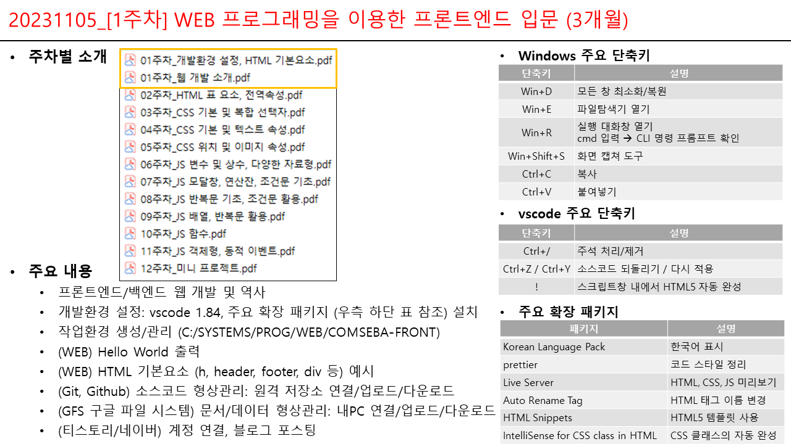
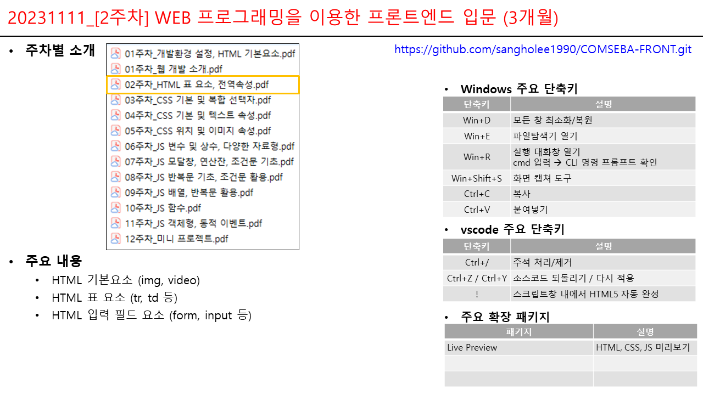
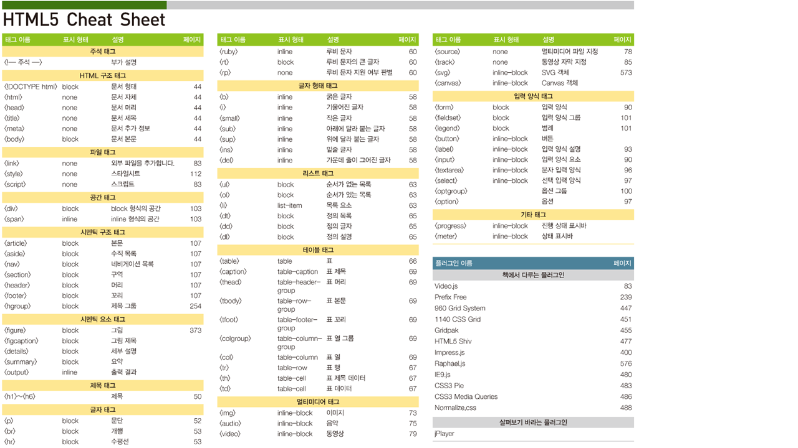
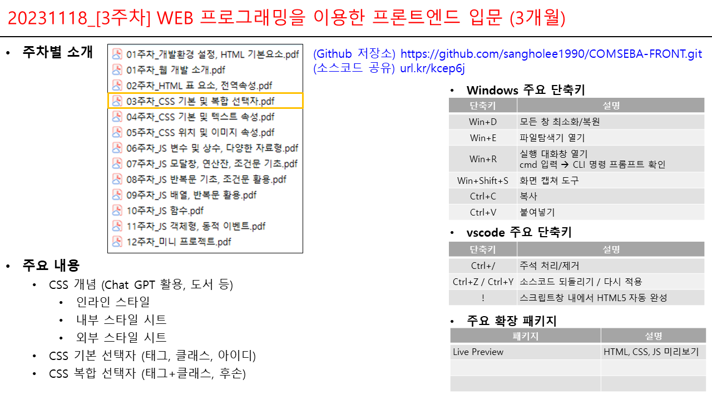
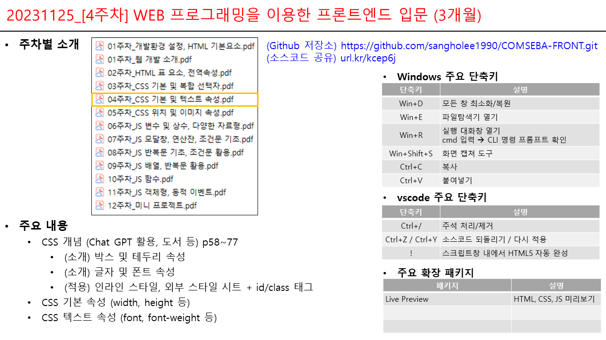
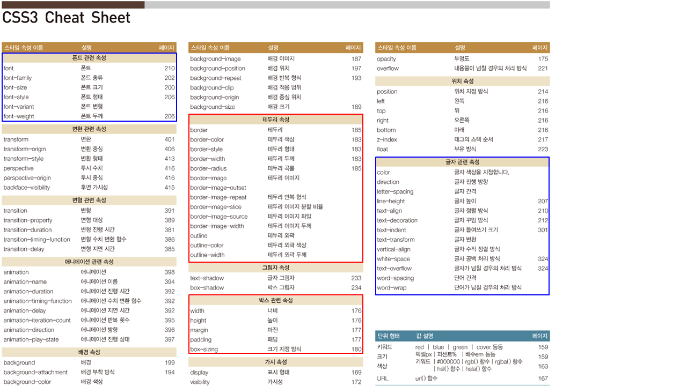
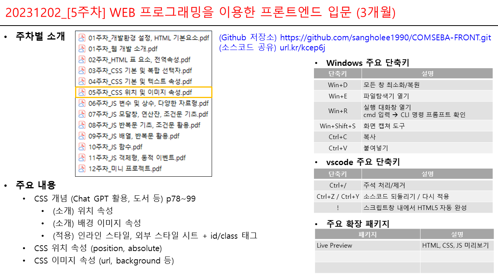
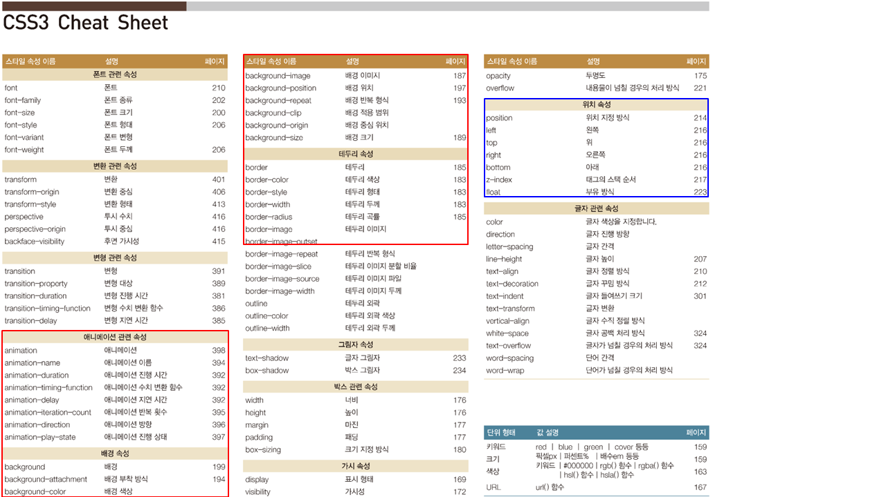

# COMSEBA-FRONT

[컴세바] WEB 프로그래밍을 이용한 프론트엔드 입문 (3개월)

-   업무명 : 주차별 계획 및 오프라인 강의안
-   작성자 : 이상호
-   작성일 : 2023.11.04
-   수정이력 :
    -   2023.11.04 : 초안
    -   2023.11.05 : 1주차
    -   2023.11.11 : 2주차
    -   2023.11.18 : 3주차
    -   2023.11.25 : 4주차
    -   2023.12.02 : 5주차
-   최종 결과물
    -   이론/실습에 대한 Github 형상관리
    -   산출물 관리 (연구노트/작품)
    -   Git, Github 소스코드 형상관리: 원격 저장소 연결/업로드/다운로드
    -   GFS 구글 파일 시스템 문서/데이터 형상관리: 연결/업로드/다운로드
    -   티스토리/네이버 계정 연결, 블로그 포스팅
-   주차별 계획

+--------+-----------------------------------------+-------------------------------------------------------+
| 구분   | 이론 (30분)                             | 실습 (1시 10분)                                       |
+:======:+=========================================+=======================================================+
| 1주차  | -   주차별 소개                         | -   프론트엔드/백엔드 웹 개발 및 역사                 |
|        |                                         |                                                       |
|        | -   실무 활용 사례                      | -   개발환경 설정                                     |
|        |                                         |                                                       |
|        | -   인터넷 검색, Chat GPT 활용 방안     | -   HTML 기본요소 (h, header, footer, div 등) 예시    |
|        |                                         |                                                       |
|        | -   결과물 관리 방안 (Git, GitHub 소개) | -   Git, Github 원격 저장소 연결/업로드/다운로드 등   |
|        |                                         |                                                       |
|        | -   웹 개발 소개                        |                                                       |
|        |                                         |                                                       |
|        | -   HTML 기본 요소                      |                                                       |
+--------+-----------------------------------------+-------------------------------------------------------+
| 2주차  | -   HTML 표/입력 요소                   | -   표 요소 (th, td 등)                               |
|        |                                         |                                                       |
|        | -   HTML 전역 속성                      | -   입력 필드 요소 (form, input 등)                   |
|        |                                         |                                                       |
|        |                                         | -   전역 속성 (class, id)                             |
+--------+-----------------------------------------+-------------------------------------------------------+
| 3주차  | -   CSS 개념                            | -   인라인 스타일, 내부 스타일 시트, 외부 스타일 시트 |
|        |                                         |                                                       |
|        | -   CSS 기본 선택자                     | -   기본 선택자 (태그, 클래스, 아이디)                |
|        |                                         |                                                       |
|        | -   CSS 복합 선택자                     | -   복합 선택자 (태그+클래스, 후손)                   |
+--------+-----------------------------------------+-------------------------------------------------------+
| 4주차  | -   CSS 기본 속성                       | -   기본 속성 (width, height 등)                      |
|        | -   CSS 텍스트 속성                     |                                                       |
|        |                                         | -   텍스트 속성 (font, font-weight 등)                |
+--------+-----------------------------------------+-------------------------------------------------------+
| 5주차  | -   CSS 위치 속성                       | -   위치 속성 (position, absolute)                    |
|        | -   CSS 이미지 속성                     |                                                       |
|        |                                         | -   이미지 속성 (url, background 등)                  |
+--------+-----------------------------------------+-------------------------------------------------------+
| 6주차  | -   JS 변수/상수                        | -   Hello World 출력                                  |
|        | -   JS 다양한 자료형                    |                                                       |
|        |                                         | -   숫자/문자/논리 자료형                             |
+--------+-----------------------------------------+-------------------------------------------------------+
| 7주차  | -   JS 모달창                           | -   모달창 (alert, prompt, confirm)                   |
|        | -   JS 기본/비교 연산자                 |                                                       |
|        | -   JS 조건문 기초                      | -   덧셈/뺄셈/곱셈/나눗셈/나머지/거듭제곱 연산        |
|        |                                         |                                                       |
|        |                                         | -   일치/불일치 연산                                  |
|        |                                         |                                                       |
|        |                                         | -   If/else if 조건문                                 |
+--------+-----------------------------------------+-------------------------------------------------------+
| 8주차  | -   JS 반복문 기초                      | -   while/for 반복문                                  |
|        | -   JS 조건문 활용                      |                                                       |
|        |                                         | -   switch문                                          |
+--------+-----------------------------------------+-------------------------------------------------------+
| 9주차  | -   JS 배열                             | -   1차원 배열                                        |
|        | -   JS 반복문 활용                      |                                                       |
|        |                                         | -   다차원 배열                                       |
|        |                                         |                                                       |
|        |                                         | -   ForEach 반복문                                    |
+--------+-----------------------------------------+-------------------------------------------------------+
| 10주차 | -   JS 함수                             | -   함수 기본값/반환값                                |
|        |                                         |                                                       |
|        |                                         | -   사용자 함수                                       |
+--------+-----------------------------------------+-------------------------------------------------------+
| 11주차 | -   JS 객체형                           | -   객체 자료형                                       |
|        | -   웹 브라우저 동적 이벤트             |                                                       |
|        |                                         | -   마우스/키보드/문서/CSS 동적 이벤트                |
+--------+-----------------------------------------+-------------------------------------------------------+
| 12주차 | -   미니 프로젝트                       | -   컴세바 사이트 제작                                |
+--------+-----------------------------------------+-------------------------------------------------------+

-   오프라인 강의안

       
